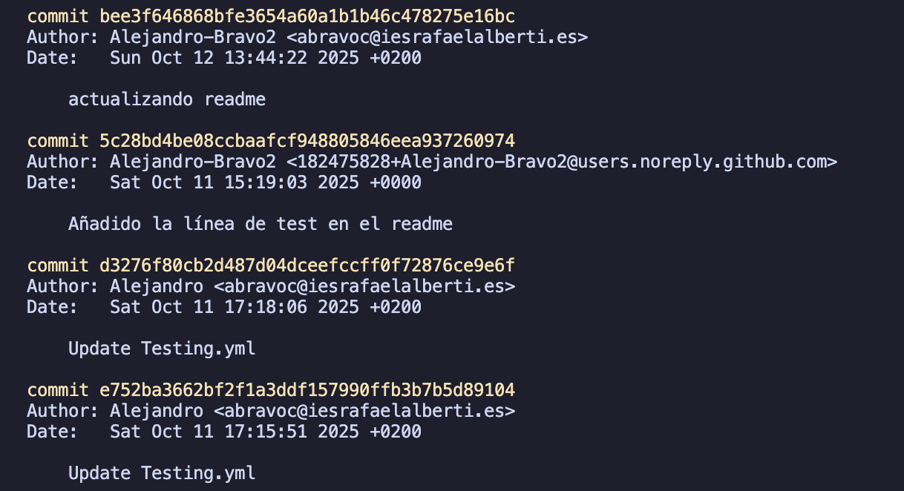

# Título de la Actividad

## Identificación de la Actividad
- **ID de la Actividad:** PI: CI/CD y documentación con GitHub Actions
- **Módulo:** Despliege de aplicaciones web
- **Unidad de Trabajo:** UD1: Documentación y Control de versiones
- **Fecha de Creación:** 30/10/2025
- **Fecha de Entrega:** 5/10/2025
- **Alumno(s):** 
  - **Nombre y Apellidos:** Alejandro Bravo Calderon
  - **Correo electrónico:** abracal@g.educaand.es
  - **Iniciales del Alumno/Grupo:** abc

## Descripción de la Actividad
La actividad consiste en configurar un github action para que realize ciertas acciones que tendríamos que realizar nosotros a mano cada vez que realizarámos un cambio.

## Instrucciones de Compilación y Ejecución
1. **Requisitos Previos:**
   - Java
   - JVM 23

2. **Pasos para Ejecutar el Código:**
   ```
   java -jar nombreArchivo.jar
   ```

3. **Pasos para ejecutar los test:**
  ```
  ./gradlew test
  ````


## Desarrollo de la Actividad
### Descripción del Desarrollo
La actividad se enfoca en aprender a usar github action para automatizar procesos que normalmente tendríamos que realizar nosotros.

### Código Fuente

https://github.com/Alejandro-Bravo2/2526_DAW_u1_action_AlejandroBravo2/blob/5c28bd4be08ccbaafcf948805846eea937260974/Java/githubAction/src/main/java/org/example/githubaction/Calculadora.java#L8-L36

https://github.com/Alejandro-Bravo2/2526_DAW_u1_action_AlejandroBravo2/blob/5c28bd4be08ccbaafcf948805846eea937260974/Java/githubAction/src/main/java/org/example/githubaction/GithubActionApplication.java#L6-L18


###### Tests:

https://github.com/Alejandro-Bravo2/2526_DAW_u1_action_AlejandroBravo2/blob/5c28bd4be08ccbaafcf948805846eea937260974/Java/githubAction/src/test/java/org/example/githubaction/GithubActionApplicationTests.java#L10-L32


## Documentación Adicional
- **Manual de Usuario:** https://github.com/Alejandro-Bravo2

## Conclusiones

He aprendido a usar github action para automatizar la realización de mis tests y documentación de mi código de forma automática. También he aprendido a usar actions creados por la comunidad en el marketplace de github actions.


---

# 1. Actividad: *GitHub Actions: entendiendo Workflow.*

## 🎯 Objetivos de aprendizaje

* Comprender la estructura de un workflow (`on`, `jobs`, `steps`).

   * Ejecutar tests automáticamente en GitHub.
   * Automatizar la actualización del `README.md` con el resultado.
 
* Explorar mejoras progresivas para descubrir el potencial de GitHub Actions.

---

## 📝 Contexto

Partimos de un **repositorio base** que contiene:

* Un programa sencillo (`main.py`).
* Un test unitario (`test_main.py`).
* Un script (`update_readme.py`) que ejecuta los tests y modifica el `README.md`, con el resultado de ejecutar los test.
* El workflow básico (`ci.yml`) que ejecuta el script y hace commit automático con `git-auto-commit-action`.

---

## 🔹 Parte 1: Workflow básico.

1. El alumno clona el repositorio base.
2. Comprende el contenido del script y del workflow.
3. Ejecuta el workflow manualmente y comprueba que el `README.md` se actualiza con una de estas dos salidas:

   * ✅ *Tests correctos*
   * ❌ *Tests fallidos*

---

## 🔹 Parte 2: Mejora obligatoria (nivel básico)

Cada alumno debe implementar al menos una de estas mejoras:

* **Historial de resultados en el README:** en lugar de sobrescribir, añadir nuevas líneas con fecha/hora.
* **Generar un archivo `report.md`:** con más detalles de la ejecución (tests pasados, fallidos, tiempo).

---

## 📑 Entregables

Cada alumno debe entregar:

1. Enlace a su repositorio con el workflow funcionando.
2. Evidencia en el historial de commits de:

   * Al menos un test correcto y uno fallido de la solución entregada.
   * Una mejora implementada (historial, report.md, badge o equivalente).
3. Breve documento (README_mejora.md) explicando:

   * Qué mejoras ha implementado.
   * Qué hace tu workflow.

---

## 📌 Evaluación (rúbrica simplificada)

* ✅ Workflow básico funciona y modifica el README.
* ✅ Al menos una mejora implementada.
* ✅ Explicación clara del funcionamiento y ventajas.


---

# 2. SOLUCIÓN: "GitHub Actions + Python Script + Auto Commit"

## 📝 Preparación del repositorio base

Estructura:

```
mi-proyecto-actions/
 ├── main.py
 ├── test_main.py
 ├── update_readme.py   👈 nuevo script
 └── README.md
```


### README.md inicial   

Una posible versión base del fichero README.md sería el siguiente (aunque finalmente será mas completo): 


```markdown
# Mi Proyecto con GitHub Actions

Este proyecto sirve para aprender a usar GitHub Actions 🚀

## 3stado de los tests
*Aún no ejecutados...*
```

---

## 🐍 Script en Python (`update_readme.py`)

Script en python. Este script ejecuta los tests y actualiza el README:

https://github.com/Alejandro-Bravo2/2526_DAW_u1_action_AlejandroBravo2/blob/5c28bd4be08ccbaafcf948805846eea937260974/tmp/updateReadme.py#L3-L14

👉 Lo que hace:

1. Lee del archivo que contiene el resultado de los test
2. Según el resultado, genera un estado ✅ o ❌.
3. Modifica el `README.md` justo debajo de la sección `## Estado de los tests`.

---

## ⚙️ Workflow (`.github/workflows/ci.yml`)

El workflow que gúía el github action:   

```yaml
name: CI con AutoCommit

on:
  push:
    branches: [ "main" ]
  workflow_dispatch:

permissions:
  contents: write   # 👈 IMPORTANTE: permite que el bot pueda hacer commits/push

jobs:
  test-and-update:
    runs-on: ubuntu-latest
    steps:
      - name: Checkout repo
        uses: actions/checkout@v3

      - name: Configurar Python
        uses: actions/setup-python@v4
        with:
          python-version: '3.10'

      - name: Instalar dependencias
        run: pip install pytest

      - name: Ejecutar script de tests y actualizar README
        run: python update_readme.py

      - name: Commit automático del README
        uses: stefanzweifel/git-auto-commit-action@v5
        with:
          commit_message: "Update README con estado de tests"
          file_pattern: README.md
```

---

## 🚦 Flujo de la actividad

1. Cuando se haga un **push** en `main`.
2. Se le da permiso de escritura para hacer commits/push al repositorio.
3. El workflow ejecuta el script en Python.
4. El script corre los tests y modifica el `README.md`.
5. La acción `git-auto-commit-action` hace commit automático con los cambios.
6. El alumno ve en el repo cómo el `README.md` se actualiza con:
    
    * ✅ Tests correctos
    * ❌ Tests fallidos

---

# 3. POSIBLES MEJORAS AL EJEMPLO ANTERIOR

La idea es que no solo no repitais el ejemplo, sino que **investigueis, mejoreis y veais el potencial real de GitHub Actions**. Para ello se piden funcionalidades **extra e imaginativas**. Aqui teneis varias propuestas, de más sencillas a más potentes, todas pensadas para que veais ventajas prácticas:

---

## 💡 Mejoras propuestas para el Action

### 1. **Historial en el README**

* Que en lugar de sobrescribir el estado, **guarden un histórico** en el README:
  
  ```markdown
  ## 3stado de los tests
  - ✅ 2025-09-22 18:00 - Tests correctos
  - ❌ 2025-09-22 17:45 - Tests fallidos
  ```
  
* 👉 Aprenderás a  **manejar fechas** y a **modificar archivos de forma acumulativa**.

---

### 2. **Generar un `report.md` con detalles**

* Crear un archivo `test-report.md` con:
    
    * Número total de tests.
    * Tests pasados y fallidos.
    * Tiempo de ejecución.

* 👉 Aprenderás a  **exportar resultados de procesos** y tener **documentación viva** del proyecto.

---

### 3. **Badges automáticos en README**

* Añadir un **badge** dinámico al README con el estado:
    
    * Verde = Tests correctos
    * Rojo = Tests fallidos
* Usando [shields.io](https://shields.io/) o generando un badge local en SVG.

* 👉 Entenderás cómo **mejorar la comunicación del estado** de un proyecto.

---

### 4. **Notificaciones externas**

* Enviar el resultado a:
    
    * **Slack/Discord** (webhook sencillo).
    * **Email** (con una acción de envío).

* 👉 Descrubrirás que Actions también sirve para **integrar con herramientas externas**.

---

### 5. **Ejecutar en múltiples entornos (matrix)**

* Hacer que los tests se ejecuten en:
    
    * Varias versiones de Python (`3.8`, `3.9`, `3.10`).
    * O en Linux y Windows.
     
* 👉 Verás la potencia del `strategy.matrix` y comprobarás compatibilidad multiplataforma.

---

### 6. **Programar ejecución automática**

* Añadir `schedule` para que se ejecute cada día a medianoche.
* El README mostraría:
  
  ```
  ✅ Última comprobación automática: 2025-09-22 00:00
  ```

* 👉 Aprenderás a **programar tareas recurrentes**.

---

### 7. **Generar una página web de resultados**

* Publicar los resultados en GitHub Pages (`gh-pages`) usando `peaceiris/actions-gh-pages`.
* 👉 Visualizarás cómo GitHub Actions puede hacer **CI/CD real** (tests + despliegue).

---

### 8. **Crear Issues automáticos si fallan los tests**

* Si un test falla → abrir un **issue automático** en el repositorio:
  
  ```yaml
  - uses: actions/github-script@v7
    with:
      script: |
        github.issues.create({
          owner: context.repo.owner,
          repo: context.repo.repo,
          title: "❌ Tests fallidos",
          body: "Se han detectado errores en los tests. Revisa el último commit."
        })
  ```
* 👉 Aprenderás a **automatizar la gestión de incidencias**.

---

## 🎯 Aprendizaje con estas mejoras

Con estas extensiones conseguireis:

* Experimentar **cómo GitHub Actions conecta piezas del desarrollo real** (tests, docs, issues, notificaciones, despliegues).
* Entender la **ventaja competitiva** de CI/CD: feedback inmediato, documentación viva y automatización.
* Pasar de un ejemplo didáctico a un flujo de trabajo que se parece mucho al que usan empresas reales.

---

# Mi Proyecto con GitHub Actions

Este proyecto sirve para aprender a usar GitHub Actions 🚀

## Implementaciones realizadas

- Automatización de ejecución de los tests
- Generación de resultados de los test en readme
- **Mejora** Agregación al resultado de los test la fecha
- Generación de documentación del código en html
- Generación de documentación del código en markdown
- Generación de página web estática vinculada al github

### Identificación de herramientas de generación de documentación. ¿Qué herramienta o generador (p. ej., Sphinx, pdoc, Javadoc, Doxygen, Dokka) utilizaste en el workflow para crear la documentación en /docs?

Se ha usado la generación con javadoc, utilicé el workfow de cicirello/javadoc-cleanup@v1.3.7 que sirve para generar la documentación de todos los ficheros java de un directorio y le indicas la carpeta de destino en mi caso /docs y te guarda alli toda la documentación.


### Documentación de componentes. Muestra un fragmento del código con comentarios/docstrings estructurados (p. ej., :param, :return: o etiquetas equivalentes) que haya sido procesado por la herramienta. Comenta que estilo de documentación has utlicado: (p. ej., reStructuredText, Google Style, KDoc)

He usado el estilo de documentación KDoc que la forma de su documentación es escribiendo la propiedad que quieres documentar (variable) y luego una descripción, tambien se documenta los return, excepciones y otras propiedades.

https://github.com/Alejandro-Bravo2/2526_DAW_u1_action_AlejandroBravo2/blob/e48c0a5e81d25a1652bc03115dae4954d4721e58/Java/githubAction/src/main/java/org/example/githubaction/Calculadora.java#L17-L24

### Colaboración. Explica cómo GitHub facilita mantener la documentación (actualizaciones del README.md y de /docs) cuando colaboran varias personas (PRs, reviews, checks de CI, protección de ramas).

Facilita mantener un control cuando varias personas trabajan en el mismo repositorio atraves de los pull request(son unas peticiones que se le mandan a los administradores del repositorio y que ellos pueden ver tus cambios y el motivo de dichos cambios, de esta forma se pueden hacer proyectos open source y que muchas personas contribuyan a dicho proyecto), las review son una forma de exigir como un chequeo de sanidad osea lo que hace es que permite que en el repositorio haya un control para los pull request y que de esta forma tengan un requisito antes de ser aceptados como por ejemplo un número de aprobaciones para dicho pull request, el chek ci son pruebas automáticas que lo que permiten es que revisen el código por cada commit y de esta forma evitar muchos errores. La protección de ramas es la forma que github implentó para evitar que los nuevos desarrolladores no hicieran un git push origin main --force al main y fastidar el trabajo de otros usuarios, lo que previene es la sobreescritura de una rama.


### Control de versiones. Muestra mensajes de commit que evidencien el nuevo workflow. ¿Son claros y descriptivos? Justifícalo. Ademas de un conjunto de mensajes de tus commits.

Pruebas de los mensajes de commit:



### Accesibilidad y seguridad. ¿Qué medidas/configuración del repositorio garantizan que solo personal autorizado accede al código y la documentación? (p. ej., repositorio privado, equipos, roles, claves/secretos, branch protection).

La protección del repositorio es que solamente yo puedo hacer cambios en el repositorio ya que soy el único con permisos, en cuanto a las claves se utiliza un .env para dichas claves.


### Instalación/uso documentados. Indica dónde en el README.md explicas el funcionamiento del workflow y dónde detallas las herramientas y comandos de documentación.


Este workflow lo que hace es trabajar con un ubuntu (ultima versión), luego se hace un checkout@5 para trarse todo el contenido del repositorio, y con el @setup-java se instala java y lo configura en concreto la versión 21 de temurin ya que es la que yo uso.

Posteriormente usa el github action de cicirello/javadoc-cleanup@v1.3.7 para generar dicha documentación de java y guardarla en el directorio doc y con el action stefanzweifel/git-auto-commit-action@v5 realiza un commit para guardar los cambios y le pone de nombre a dicho commit: Commit automático del README

https://github.com/Alejandro-Bravo2/2526_DAW_u1_action_AlejandroBravo2/blob/e48c0a5e81d25a1652bc03115dae4954d4721e58/.github/workflows/readme.yml#L1-L30


Para el workflow de testing se ha realizado en un ubuntu latest y sigue el mismo flujo de instalarse java que en el primer workflow, luego se instala python ya que para la actualización del readme he usado un script en python. Luego con el @setup-gradle lo que hace es instalar gradle y luego con el build lo ejecutaría.

Luego con este comando: ./gradlew test > ../../tmp/test-report.md || true lo que haría es ejecutar dicho gradlew para los test y guardar el reporte en un fichero test-report.md.

Luego se ejecutaría el script de python para que actualizara el readme agregando la nueva información sacada de dicho fichero con los test.


Luego se ejcutaría el action de stefanzweifel/git-auto-commit-action@v5 que lo que hace es realizar dicho commit y subirlo a la rama main y usando el nombre de actualización de README.

https://github.com/Alejandro-Bravo2/2526_DAW_u1_action_AlejandroBravo2/blob/e48c0a5e81d25a1652bc03115dae4954d4721e58/.github/workflows/Testing.yml#L1-L44

# TESTS

## 1 Estado de los tests
✅ Tests correctos
## Resultado del test, Fecha: 2025-10-11 14:53:07.637420
✅ Tests correctos
## Resultado del test, Fecha: 2025-10-11 15:19:02.711710
❌ Tests fallidos
## Resultado del test, Fecha: 2025-12-15 16:22:35.408792
❌ Tests fallidos
